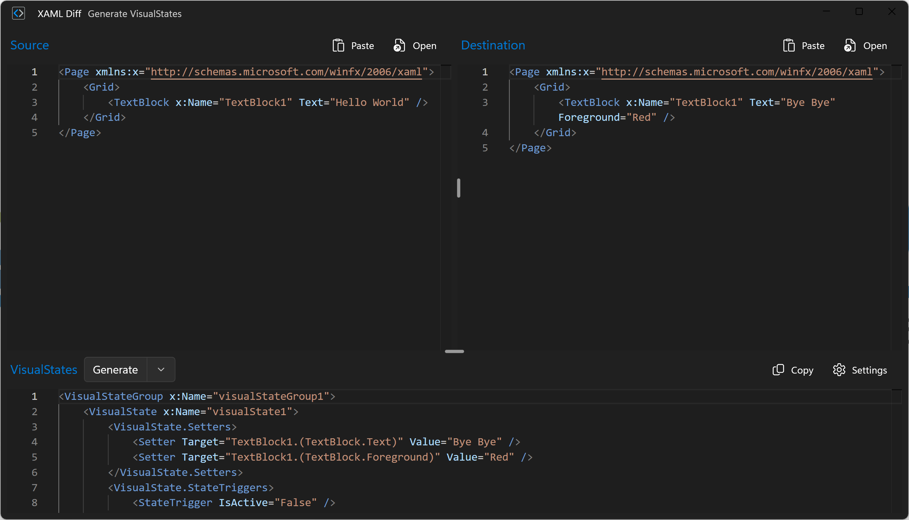
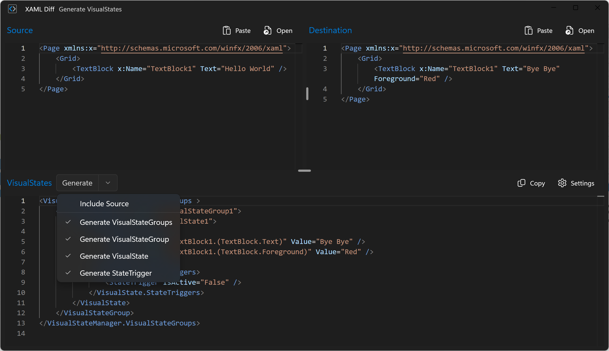
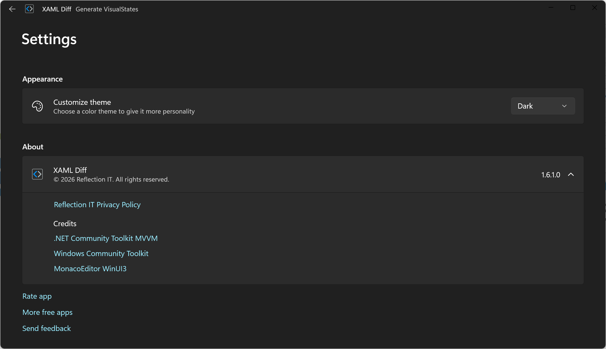
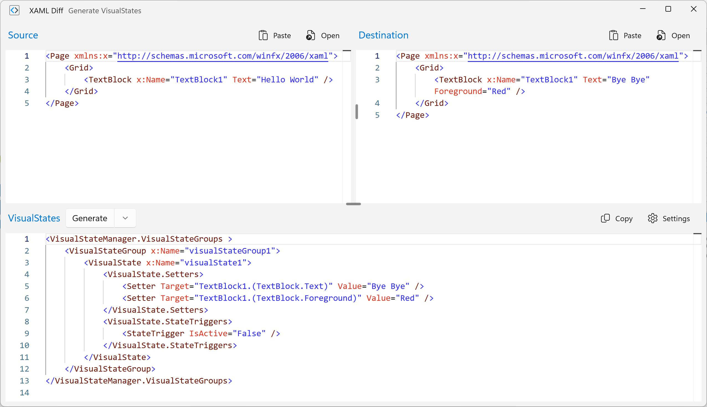
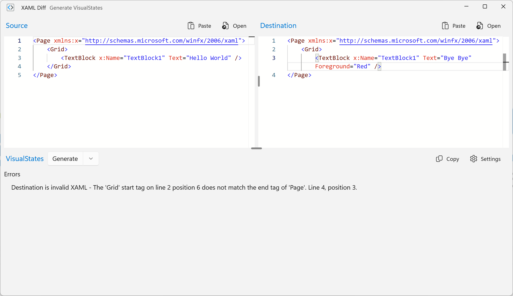

  

<h1 align="center">
  XAML Diff
</h1>

  Generates the VisualState Setters using a diff analysis of your named elements in your XAML

  

# Overview
This free tool helps yout to generate the VisualState Setters using a diff analysis of your named elements in your XAML. This was a feature of Visual Studio Blend but not any more. This tool come to the rescue.

# Screenshots

# Contributing
Please freely open issues to report bugs, suggest features, or ask a question. Feel free to make a Pull Request but I cannot guarantee your PR will be merged quickly.

# Build with
- WindowsAppSDK 
- WinUI
- .NET Community Toolkit MVVM
- Windows Community Toolkit
- MonacoEditor WinUI3

# Contact
- Bluesky: [@fonssonnemans.bsky.social](https://bsky.app/profile/fonssonnemans.bsky.social)
- Mail: fons dot sonnemans at reflectionit dot nl